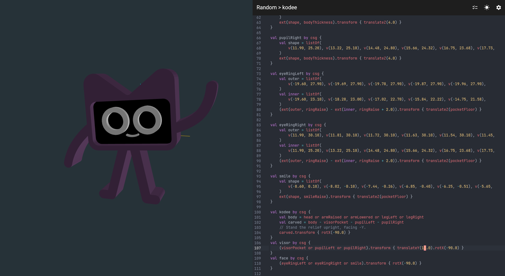
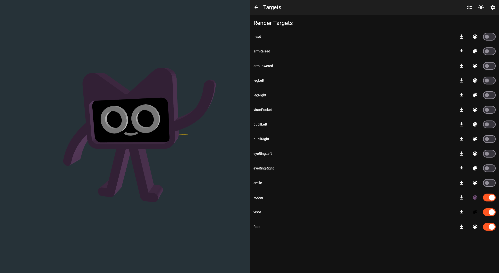

# Konstructor

Konstructor is a browser-based 3D model builder. You write Kotlin scripts using the
[kcsg](https://github.com/Monkopedia/KCSG) constructive-solid-geometry DSL, and Konstructor
compiles and renders them to interactive 3D right in the browser — edit on one side, orbit the
model on the other.



## Features

- **Write models in the kcsg Kotlin DSL** — primitives, boolean operations (`+`, `-`, `*`),
  transforms, and extrusions, edited in a CodeMirror editor with theme and Vim/Emacs keymap support.
- **Live compile + render** — scripts are compiled and executed server-side, with the resulting
  meshes streamed to a WebGL (three.js) viewport over WebSockets.
- **Per-target rendering and coloring** — a script can expose multiple named targets; each can be
  toggled and recolored independently, so a single model can be assembled and shown in multiple colors.
- **Workspaces and konstructions** — organize your scripts, with selection and settings persisted
  across sessions.
- **Configurable scene** — adjustable ambient/directional lighting and an orbit camera.



## Architecture

A Gradle multi-module project (version catalog in `gradle/libs.versions.toml`):

| Module | Platform | Role |
| --- | --- | --- |
| **protocol** | KMP (JVM/JS/WasmJS) | Shared [ksrpc](https://github.com/Monkopedia/ksrpc) service interfaces — the backend↔frontend contract. |
| **lib** | JVM | CSG geometry integration (bundles kcsg); compiles and runs user scripts. |
| **frontend** | Kotlin/WasmJS + Compose Multiplatform | Material3 UI + three.js renderer, compiled to WebAssembly. |
| **backend** | JVM (Ktor) | Serves the frontend, manages workspaces/konstructions, compiles scripts, and talks to the frontend over WebSockets. |
| **e2e** | JVM | Playwright end-to-end tests. |

All cross-process communication runs over **ksrpc**: the same typed service interfaces carry calls
between the frontend and backend over WebSockets *and* between the backend and the sandboxed Kotlin
subprocess that compiles and executes each user script — so the editor, the renderer, and the script
runner all talk through one RPC layer.

Konstructor is built on a stack of the author's own libraries:
[**kcsg**](https://github.com/Monkopedia/KCSG) (geometry),
[**ksrpc**](https://github.com/Monkopedia/ksrpc) (RPC over WebSockets),
[**hauler**](https://github.com/Monkopedia/hauler) (structured logging), and
[**kodemirror**](https://github.com/Monkopedia/kodemirror) (a Compose Multiplatform CodeMirror
wrapper that provides the script editor).

## Build & run

Requires JDK 21.

```bash
# Build the fat JAR (bundles the Wasm frontend + lib into the backend)
JAVA_HOME=/usr/lib/jvm/java-21-openjdk ./gradlew shadowJar

# Run it
java -jar backend/build/libs/backend-all.jar --http 8080 --websockets
# then open http://localhost:8080
```

## License

Apache License 2.0. See [LICENSE](LICENSE).

The Kodee model pictured is adapted from JetBrains' Kotlin mascot — *Kodee by JetBrains s.r.o. is
licensed under [CC BY 4.0](https://creativecommons.org/licenses/by/4.0/) and adapted here into a 3D
relief.* The model source lives as a sample in the [kcsg repository](https://github.com/Monkopedia/KCSG).
Changes were made; not affiliated with or endorsed by JetBrains. See
[THIRDPARTY-LICENSE.txt](THIRDPARTY-LICENSE.txt).
